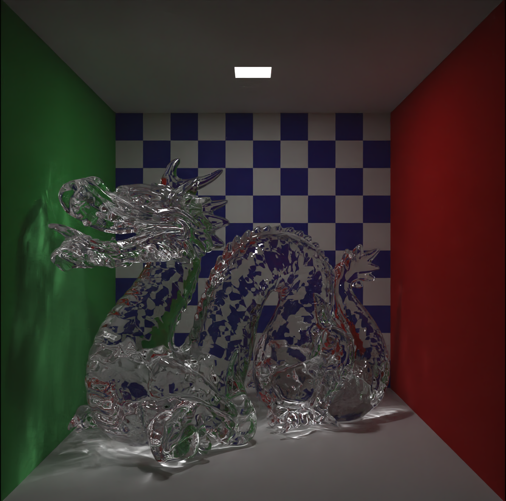

# Chroma Renderer

Chroma is a [Vulkan](https://www.vulkan.org/) and [OptiX](https://developer.nvidia.com/rtx/ray-tracing/optix) based, unbiased unidirectional Monte Carlo path tracer. It features a Vulkan based rasterized viewport, intended to be a preview viewport with basic shading, and an OptiX based ray-traced viewport. It uses [Dear ImGui](https://github.com/ocornut/imgui) to allow run-time control of scene settings. 

## Features

- Vulkan viewport
	- Multi-sampled anti-aliasing
	- Run-time generated texture mip maps
	- Multiple shaders:
		- *Solid* -- mimics Blender's Solid shading
		- *Flat* -- displays diffuse color (e.g. texture) only
		- *Normal* -- view world-space normals of mesh
	- Gizmos:
		- World-grid lines
		<!-- - (Planned) Area light, point/spot light, directional light indicators -->
- Path-traced viewport
	- Optional Russian Roulette path termination
	- Optional stratified sampling
	- Materials (all with texture support for reflections)
		- Lambertian diffuse
		- Conductors
		- Dielectrics (with extinction, fresnel reflection/refraction)
		- Diffuse light
	- HDR environment maps
	- Multiple importance sampling with an adjustable light sampling rate
	- Optional OptiX denoiser
- Shared scene descriptions for both view ports
- Run-time shader compilation for Vulkan and OptiX
- Run-time scene switching
- Interactive camera
	- Perspective and orthographic camera projection modes
		- Additional thin lens projection mode in OptiX
	- Free-fly and Orbit camera modes
- Asynchronous OptiX kernel execution to allow for a smoother UI experience when running computationally expensive kernels.

## Camera Controls

- Scroll wheel increases/decreases... 
	- FOV for perspective and thin lens projection
	- orthographic scale (i.e., sensor size) for orthographic projection

### Free-fly camera

- Left-click and drag rotates camera view while maintaining camera position
- W/A/S/D moves forward/left/back/right with respect to current camera orientation
- CTRL moves camera down z-axis
- SPACE moves camera up z-axis
- SHIFT increases movement speed when combined with W/A/S/D keys

### Orbit camera

- Left-click and drag orbits the camera with respect to origin of the orbit
- SHIFT + Left-click and drag moves the origin up/down/left/right perpendicular to current camera orientation
- CTRL + Left-click and drag moves the camera closer/farther to the origin of the orbit

## Using Chroma

### Pre-requisites

- An NVIDIA GPU (Maxwell and newer generation GPUs)
- [Vulkan SDK](https://vulkan.lunarg.com/)
- [OptiX SDK](https://developer.nvidia.com/designworks/optix/download)
- [CUDA Toolkit](https://developer.nvidia.com/cuda-toolkit)
- [Visual Studio 2022](https://visualstudio.microsoft.com/)

### Build

You *should* be able to simply clone this repo, then open the Chroma solution and run it. Note: the default scenes are dependent on meshes that are not saved to the repo due to their size. To launch with the default scenes, you can replace the contents of the `res` folder with [these folders](https://drive.google.com/drive/folders/1iK7FeU2yvCGPUKDQGNKDLJzOBOCquMDG?usp=drive_link) which contain the meshes and textures used by them.

## Resources

In no particular order, some of the resources I used in creating Chroma:

- [ImGui Docking Branch GLFW and Vulkan Example](https://github.com/ocornut/imgui/tree/docking/examples/example_glfw_vulkan)
- [ImPlot Plotting Library for ImGui](https://github.com/epezent/implot)
- [Walnut by the Cherno](https://github.com/StudioCherno/Walnut)
- [Vulkan Lecture Series from TU Wien](https://youtube.com/playlist?list=PLmIqTlJ6KsE1Jx5HV4sd2jOe3V1KMHHgn&si=uBU461ubxmseYhY6)
- [Vulkan Tutorial by Alexander Overvoorde](https://vulkan-tutorial.com/)
- [Runtime Shader Compilation Tutorial by GetIntoGameDev](https://youtu.be/z1QrxFTrO8E?si=w7T9i_3PLV3Jrit-)
- [OptiX Intro Course by Ingo Wald](https://github.com/ingowald/optix7course)
- [How to Get Started With OptiX 7 by Keith Morley](https://developer.nvidia.com/blog/how-to-get-started-with-optix-7/)
- [Ray Tracing in One Weekend with CUDA & OptiX by David Crook](https://github.com/idcrook/weeker_raytracer/tree/main)
- [Ray Tracing in One Weekend Series by Peter Shirley](https://raytracing.github.io/)
- [Physically Based Rendering book by Pharr, M., Jakob, W., and Humphreys, G.](https://pbr-book.org/)
- [OptiX Advanced Samples](https://github.com/nvpro-samples/optix_advanced_samples/tree/master)
- [Stack Exchange Post on Light Sampling](https://computergraphics.stackexchange.com/questions/5152/progressive-path-tracing-with-explicit-light-sampling)
- [MIS Paper by Veach and Guibas](https://history.siggraph.org/learning/optimally-combining-sampling-techniques-for-monte-carlo-rendering-by-veach-and-guibas/)